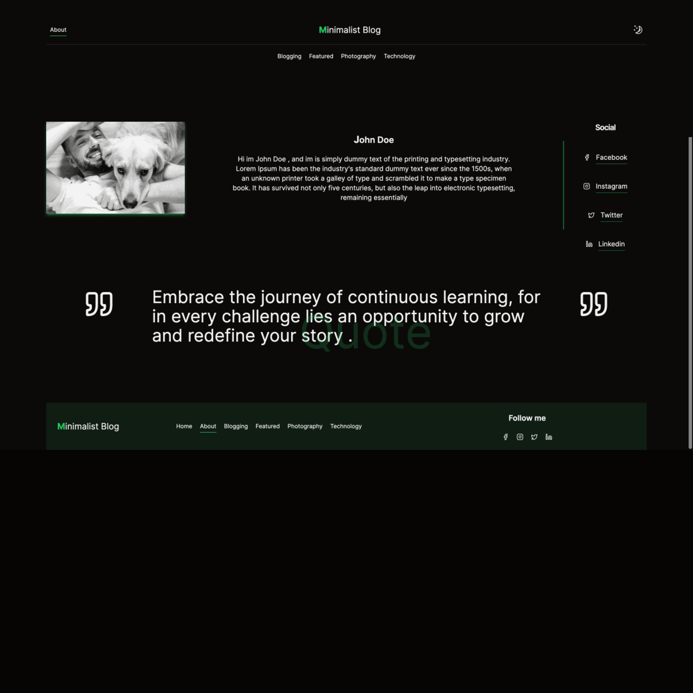

## Demo

- Check the online demo : [https://dcxtivbm7nals.cloudfront.net/](https://dcxtivbm7nals.cloudfront.net/)

## Next-Themes-SEO



#### Unlighthouse Score


#### Stack

- [x] Nextjs 14
- [x] TypeScript
- [x] Tailwindcss
- [x] Shadcn/ui

#### Features

- [x] Static blog generated on build time
- [x] Articles based on markdown files
- [x] Categories based on folders names
- [x] Multi theme
- [x] Easy to add your own theme
- [x] Images optimized at build time
- [x] Dark mode
- [x] SEO Optimized
- [x] /Sitemap.xml
- [x] /robots.txt
- [x] 404 page

## Getting Started

##### Add your posts and categories

```bash
- src/posts
   - /categorie_name1
     - post.md
```

> Note : to show categorie image , you can add the image in /public/images/categorie_name1.png

##### Add your own theme

You can add your own theme by duplicating minimal theme folder , make your own changes and the refer to it in defaultTheme.ts .

```bash
src/themes
   /minimal
   /minimal2
   defaultTheme.ts
   ...
```

##### defaultTheme.ts

```Javascript
import * as Theme from './minimal';

export default Theme;
```

##### Change your blog info from only one single file

Path : /src/config/profile.ts

```javascript

export const profileSetting = {
  full_name: 'John Doe',
  blogName: 'Minimalist Blog',
  author_about:
    "Hi im John Doe , and im is simply dummy text of the printing and typesetting industry. Lorem Ipsum has been the industry's standard dummy text ever since the 1500s, when an unknown printer took a galley of type and scrambled it to make a type specimen book. It has survived not only five centuries, but also the leap into electronic typesetting, remaining essentially ",
  quote:
    'Embrace the journey of continuous learning, for in every challenge lies an opportunity to grow and redefine your story .',
  avatar: '/images/author-6.jpg',
  facebook: 'https://facebook.com',
  instagram: 'https://instagram.com',
  twiter: 'https://twitter.com',
  linkedin: 'https://linkedin.com',
  metaTitle: 'My Awesome Blog',
  metaDescription: 'This is my Coding Blog',
  metaGraphImage: '/images/flower.jpeg',
  metaKeywords: ['Next.js', 'React', 'JavaScript'] as string[],
  metadataBase:
    process.env.NODE_ENV === 'development'
      ? new URL('http://localhost:3000')
      : new URL('https://dcxtivbm7nals.cloudfront.net'),
} as const;

```

##### Install dependencies :

```bash
npm install
```

##### Run the development server:

```bash
npm run dev
```

##### Build your blog :

```bash
npm run build
```

##### Serve locally :

```bash
npm run start:static
```

##### Check your lighthouse score for all routes :

```bash
npm run score
```

##### Deployment

You can deploy this project for free into [Vercel](https://vercel.com/) , [Netlify](https://www.netlify.com/) or [Cloudflare Page](https://www.cloudflare.com/plans/developer-platform/) etc...

##### Deploying to aws/s3 & cloudfront

if you prefer to deploy your app to s3 bucket , you can use a deployment script named (aws.sh) that i included in this project , add your access keys from AWS IAM then run the script .

###### Command

```bash
sh aws.sh
```
